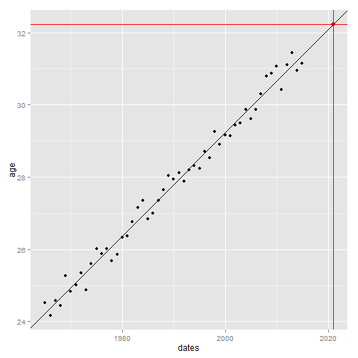

Presentation: Age for maternity?
========================================================
author: AUREGAN Pascal
date: June 16 2015
transition : rotate

Presentation
========================================================

"Age for maternity?" is a completely useless application. But it made me having fun with R.

From a calculated year, the application will give the user the mean of age for first maternity this year with a linear model prediction. 

So the user can compare with the year the user expects having a baby. 

Maybe the user will be arround the mean, maybe not.

A graphic can help the user to visualize data and the predicted value in this data.

What does it do?
========================================================
transition : concave

- The user can chose the **year** he was born with a slider
        $$year \in \left[1965, 2015\right]$$

- The user choose the **country** in France or United States
- The user choose the **age** he expects having a baby

- The application will give the user a **predicted** age when people have a baby the given year (year he was born + expected age for maternity)

How does it work? 1/2
========================================================
transition-speed : slow
transition : zoom

The data used for prediction is generated with a given country:

$$
ages = \frac{\left[min\_age_{Country}\times100, max\_age_{Country}\times100\right]}{(2015-1965)\times100}+\mathcal{N}(0, 0.3)
$$

How does it work? 2/2
========================================================
From this data, a prediction model is created with ***lm*** function.

Adding the year the user is born to the age he expects gives the year to predict the age of maternity.

A graph representing the linear regression line, the original points and the predicted one is also shown to the user.
***

 
When you will be / was 29 in 2021 the predicted mean should be 32.2217666

